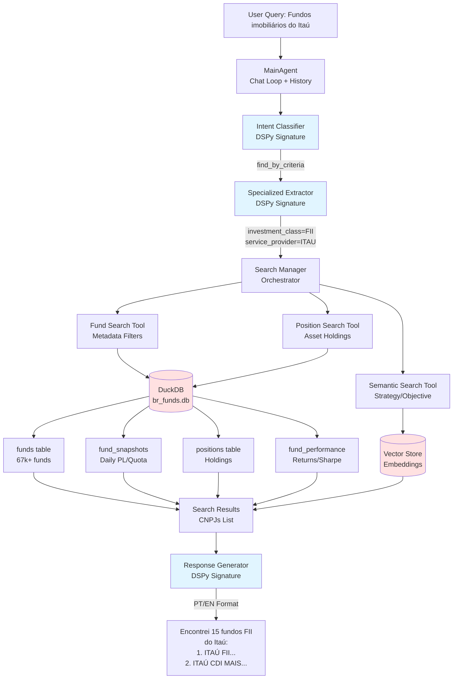

# Frontier AI Fund Search


**An Agentic AI system for discovering and analyzing Brazilian Investment Funds.**

This project uses **DSPy** to orchestrate a deterministic agent that can query massive quantitative datasets (DuckDB) and qualitative documents (Vector Store) about brazilian funds to answer queries with some precision.

## ⚠️ Important: Data Requirements

This project relies on large local datasets that are **not included in git** due to size. You must populate the `src/infrastructure/database/` directory before running the agent.

| File/Directory      | Description                                                                              | Source                                                |
| ------------------- | ---------------------------------------------------------------------------------------- | ----------------------------------------------------- |
| **`br_funds.db`**   | **Primary Database.** DuckDB file containing 67k+ funds, daily snapshots, and positions. | Generated via `ingest_cvm.py` from CVM Open Data.     |
| **`extracted/`**    | Directory containing JSONL files for entity resolution (Managers, Custodians).           | Extracted from CVM data for fast fuzzy matching.      |
| **`vector_store/`** | Local directory storing vector embeddings for semantic search.                           | Generated via `build_embeddings.py` from PDF Lâminas. |
| **`mlflow.db`**     | SQLite database for tracing agent runs.                                                  | Created automatically by `start_mlflow.sh`.           |

> **Note:** Without `br_funds.db`, the agent cannot perform any quantitative searches (returns, fees, holdings).

## Core Technologies

- **[DSPy](https://github.com/stanfordnlp/dspy):** We use DSPy modules and signatures instead of brittle prompt engineering. This allows the agent to self-optimize and learn from examples.
- **[MLflow](https://mlflow.org/):** Used for **LLM Tracing**. Every step (intent, extraction, search) is logged as a span, allowing full observability into the agent's "thought process".

## System Workflow



## Project Structure

```
frontier-ai-ps/
├── src/
│   ├── agent/
│   │   ├── fund_search/          # Core Search Agent
│   │   │   ├── orchestrator.py   # Main coordination logic
│   │   │   ├── signatures/       # DSPy Signatures (Intent, Extraction)
│   │   │   ├── modules/          # DSPy Modules (Classifiers, Extractors, Managers)
│   │   │   ├── tools/            # Specialized Search Tools
│   │   │   ├── models/           # Pydantic Models (State, Output, Query)
│   │   │   ├── utils/            # Utilities (Mappings, Tracing)
│   │   │   └── tests/            # E2E and Module Tests
│   │   ├── main_agent.py         # Top-level Agent (Chat & History)
│   │   └── response/             # Response Generator
│   ├── infrastructure/
│   │   ├── database/             # DuckDB adapters & schema
│   │   └── ingestion/            # Scripts to load CVM data
│   └── evaluation/               # DSPy Optimizers (GEPA) & Metrics
├── docs/                         # Architecture & Design Docs
└── scripts/                      # Helper scripts (start_mlflow.sh)
```

## Fund Search Tools

The `FundSearchTool` delegates to specialized sub-tools for safety and precision:

| Tool                   | Purpose                                          | Source                        |
| ---------------------- | ------------------------------------------------ | ----------------------------- |
| **search_funds**       | Metadata filtering (Manager, CNPJ, Type, Status) | `funds` table                 |
| **search_performance** | Returns fund metrics                             | `fund_performance_indicators` |
| **search_positions**   | Asset holdings (Stock, Bond, Debenture lookups)  | `positions` table             |
| **search_snapshots**   | Daily PL, Quota, Captação (Flows)                | `fund_snapshots` table        |
| **search_semantic**    | Qualitative search (Strategy, Objective, Risk)   | Vector Store (Lâminas)        |

## Quick Start

### 1. Installation

```bash
# Clone
git clone https://github.com/your-org/frontier-ai-ps.git
cd frontier-ai-ps

# Install dependencies with uv
uv sync
```

### 2. Configure

Copy `.env.example` to `.env` and add your `OPENAI_API_KEY`.

### 3. Run

```bash
# Interactive Chat
uv run dspy-agent chat

# Single Query
uv run dspy-agent ask "give me bradesco gold fund"
```

## Documentation

- **[Architecture](docs/architecture.md)** - System components and high-level design
- **[Agent Workflow](docs/agent_workflow.md)** - Query processing flow from intent to response
- **[Intents and Tools](docs/intents_and_tools.md)** - Intent classification and tool mapping strategy
- **[Ambiguity Handling](docs/ambiguity_handling.md)** - How ambiguous queries are detected and resolved
- **[Data Pipeline](docs/data_pipeline.md)** - Database schema and data ingestion process
- **[MLflow Integration](docs/mlflow_integration.md)** - LLM tracing and observability setup
- **[Testing](docs/testing.md)** - Test structure, markers, and running tests
- **[Evaluation](docs/evaluation.md)** - DSPy GEPA optimization results and evaluation methodology
