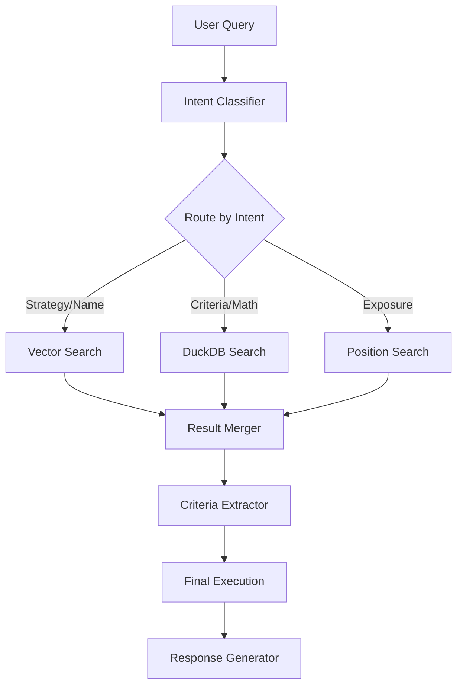

# Agent Workflow

## The Orchestrator Lifecycle

The `FundSearchTool` (`orchestrator.py`) manages the end-to-end lifecycle of a query. It is designed to be **fail-fast** and **transparent**.

## Phase 1: Understanding (`modules/intent.py`)

The agent does not blindly search. It first understands:

1.  **Intent:** Which of the 6 specific search modes to use?
2.  **Language:** Is the user speaking PT or EN?
3.  **Ambiguity:** Is the request clear?

### DSPy Signatures & Metacognition

We define the _interface_ of understanding via `IntentClassificationSignature`.

- **Inputs:** `query` (User text), `history` (Conversation context).
- **Outputs:** `intents` (List of enums), `search_query` (Optimized string), `is_potentially_ambiguous` (Boolean).

### The Interpretation Note

Crucially, the agent outputs an **`interpretation_note`**. This is a metacognitive field where the agent explains _why_ it chose a certain interpretation.

- **Example:** User asks "Bradesco Gold".
- **Agent Note:** "I interpreted this as a Bradesco fund tracking gold prices (Strategy), not a fund literally named 'Bradesco Gold' which does not exist."
- **Benefit:** This note is passed to the Response Generator, allowing the final answer to be transparent: _"I looked for Bradesco funds with a Gold strategy..."_

## Phase 2: Extraction (`modules/extraction.py`)

We convert natural language into a strict Pydantic `SearchQuery` model.

### Strict Schema Validation

To prevent "hallucinated SQL", we enforce strict Pydantic models with Enums. The LLM cannot invent categories; it must map to our valid list:

- **Fund Type:** `FI`, `FIP`, `FIDC`, `FII`, `ETF`.
- **Investment Class:** `Multimercado`, `Ações`, `Renda Fixa`, `Cambial`.
- **Audience:** `PROFESSIONAL`, `QUALIFIED`, `RETAIL`.

### Constraint Enforcement

The `ExtractCriteriaSignature` has strict instructions:

1.  **Explicit Only:** "Return `None` for any field NOT explicitly mentioned. Do NOT infer defaults."
2.  **Numeric Normalization:** "200M" is automatically converted to `200,000,000` float.
3.  **Operator Mapping:** "At least 10%" becomes `{operator: "min", value: 10}`.

## Phase 3: Execution (`search_manager`)

The `SearchManager` executes the logic defined by the intent:

- **Parallel Execution:** If a query needs both Performance and Metadata, we can run them in parallel (future optimization).
- **Context Awareness:** It checks the `ConversationState`. If the user says "and distinct from previous", it explicitly excludes prior CNPJs.

## Phase 4: Conversation Management & Follow-Up

A key design decision was to **Ask, Don't Guess.** The `ConversationManager` acts as a gatekeeper before and after the search.

### Pre-Search Checks

- **Ambiguity:** If `is_potentially_ambiguous` is True (e.g., "Best funds"), the agent halts and asks for clarification ("Define 'best'").

### Post-Search Checks

- **Result Overflow:** If we find > 20 funds, we do NOT show them. The manager triggers a `too_many_results` response, suggesting filters (e.g., "Found 50 funds. Filter by Manager?").
- **Empty Results:** If 0 funds are found, we analyze _why_. The agent suggests relaxing specific constraints (e.g., "No funds found with >50% return. Try >20%?").

## Phase 5: Response Generation

The final answer is synthesized by the `ResponseGenerator` module.

- It combines the **structured data** (returns, names) with the **interpretative context** ("I looked for high-yield funds...").
- It respects the user's detected language (PT/EN).
