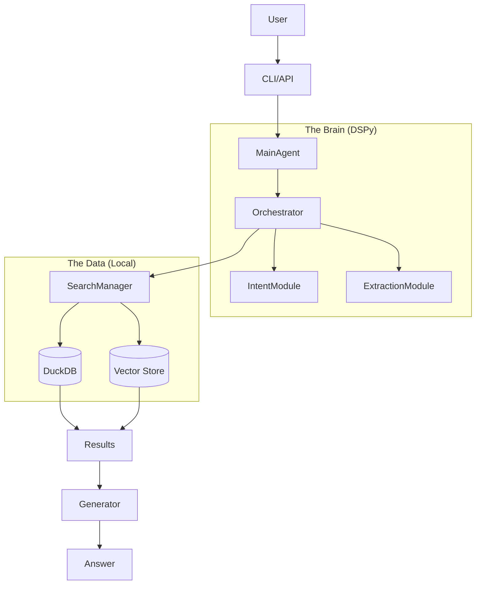

# System Architecture

## Core Components

### 1. DSPy (Declarative Self-Improving Python)

We chose **DSPy** over traditional libraries (LangChain/LlamaIndex) to solve the "brittle prompt" problem.

- **Why not LangChain?** Traditional chains rely on hard-coded string templates. If the LLM changes (e.g., GPT-3.5 to GPT-4), the prompts often break.
- **The DSPy Advantage:**
  - **Signatures vs. Prompts:** We define _what_ we want (Input: Query -> Output: SearchParams), not _how_ to get it.
  - **Optimizers:** DSPy includes optimizers (like MIPRO) that can "compile" our agent. It automatically iterates on the prompts and few-shot examples to maximize a metric (e.g., "Correctly extracted CNPJ"), treating the prompt as a learned weight.

### 2. Workflow vs. ReAct

We implemented a **Workflow** pattern rather than a generic **ReAct** (Reason+Act) loop.

- **Why Workflow?**
  - **Determinism:** Financial search requires predictable steps. We _always_ want to Understand -> Extract -> Search.
  - **Control:** ReAct agents often get stuck in loops or hallucinate tools. A directed graph (DAG) ensures the agent follows a proven path.
  - **Efficiency:** We can run parallel search steps (Vector + SQL) which is hard to coordinate in a purely reactive loop.

### 3. MLflow Observability

We integrated **MLflow** for deep observability into the agent's cognition.

- **Why MLflow?**
  - **Tracing:** AI agents are non-deterministic. We need to see the exact input/output of every step (Intent, Extraction, Tool) to debug "why did it think 'Apple' was a fruit and not a stock?".
  - **Evaluation:** It allows us to run regression tests against a "Golden Dataset" of questions, ensuring that new prompts don't break existing capabilities.

## High-Level Diagram

## Key Design Decisions

1.  **Local-First:** The agent runs entirely locally (except LLM API calls). No cloud database required.
2.  **Schema-First:** We force LLMs to output structured JSON (Pydantic) compatible with our database schema, preventing "hallucinated columns".
3.  **Traceability:** Every decision point is logged. If the agent fails, we know exactly which module (Intent vs. Extraction) was responsible.
